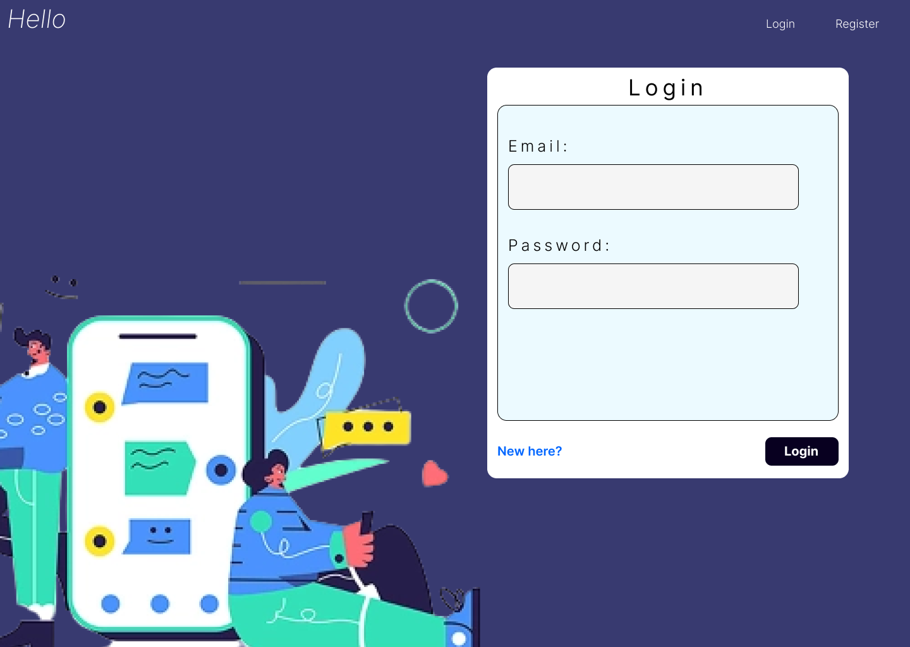
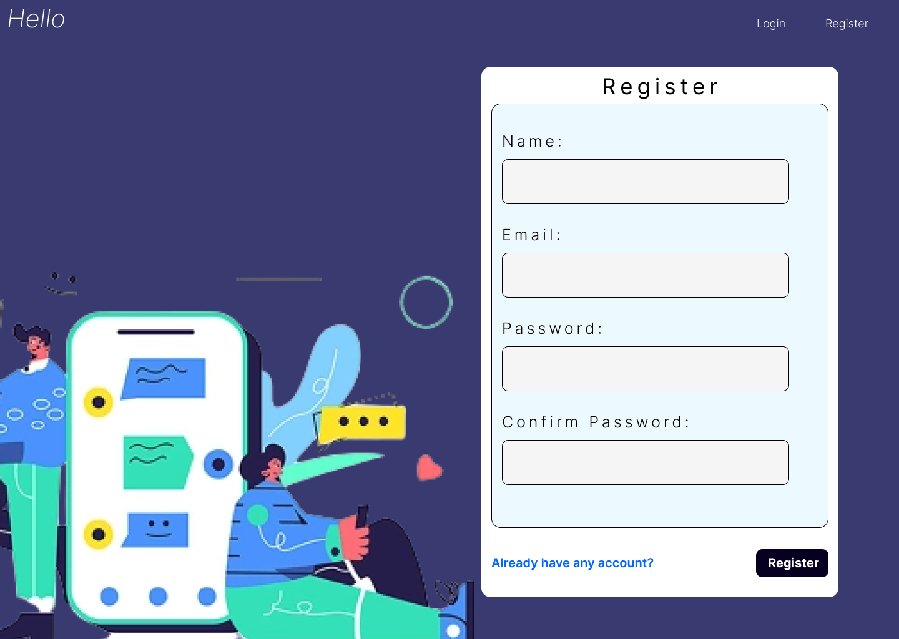
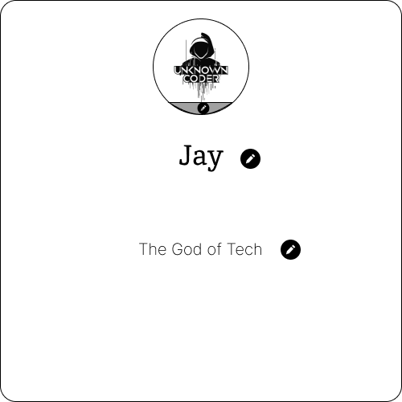
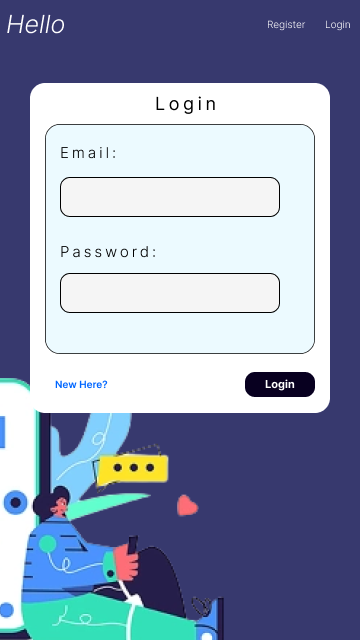
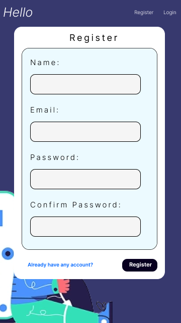

# **Hello 💬**

## Web based chat application built with MERN Stack.
### A Full Stack Web Application made by Jay.
### Easily and freely communicate with others.

---

## **Features 💡**
- **Login/Logout** and **Register**
- **Send** and **Receive** messages to **one-to-one chat** and **group chat**
- **Search Users**
- **Create** or **Delete** group
- **Add** or **Remove** members from the group

---

## **Technologies Used 💻**
- **Frontend 👁‍🗨 :** React.js
- **Backend 🌐 :** Node.js and Express.js
- **Database 📈 :** MongoDB
- **Connection 🔗 :**: Socket.IO
- **UI:** Material UI
- **Designing:** Figma
- **Authentication 🔒 :** JWT Auth

---

## **Images 📷**
- **Desktop**
    - **Login**
    
    - **Register**
    
    - **Landing Page**
    
    - **Home Page**
    
    - **About Group**
    
    - **Profile**
    
    - **Search Users**
    
- **Phone**
    - **Login**
    
    - **Register**
    
    - **Landing Page**
    
    - **Home Page**

---

## **Contribute? 💖**
- Clone the repository: **https://github.com/Jay-Karia/Hello.git**
- Install required packages by ``` npm install``` in **client** and **server** directories
- Run ``` npm start ``` in both the directories
- Make changes and add features
- Send a **Pull Request**

---

## **GitHub 😸**
- **https://github.com/Jay-Karia/Hello**